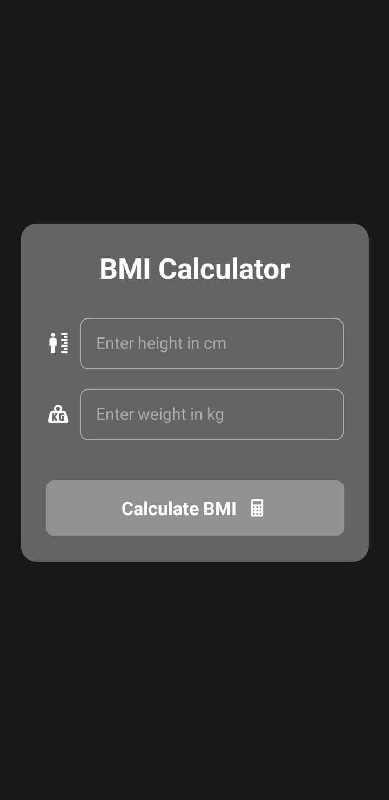

# 🧮 BMI Calculator App

This is a simple Body Mass Index (BMI) Calculator built using **React Native with Expo**. It was created as part of a hands-on workshop at IIIT Nagpur aimed at helping beginners learn React Native.

## 🚀 Features

* Enter your weight (kg) and height (cm) to calculate BMI.
* Displays BMI value and category (e.g., Underweight, Normal, Overweight, Obese).
* Clean and minimal UI.

## 📱 Screenshots

<div align="center">
  
</div>

## 🛠️ Technologies Used

* React Native
* Expo

## 📦 Installation

1. Clone the repo:

   ```bash
   git clone https://github.com/DoonMad/react-native-workshop.git
   ```
2. Navigate to the app directory:

   ```bash
   cd react-native-workshop/BMI-Calculator
   ```
3. Install dependencies:

   ```bash
   npm install
   ```
4. Start the app:

   ```bash
   npx expo start
   ```

## 📚 Workshop Context

This app was used in a beginner-friendly hands-on workshop to:

* Demonstrate basic layout and styling in React Native.
* Introduce state management with `useState`.
* Teach handling user input and displaying computed values.

## 📄 License

MIT License.

---

*Developed with ❤️ by Apoorva Mundada.*
